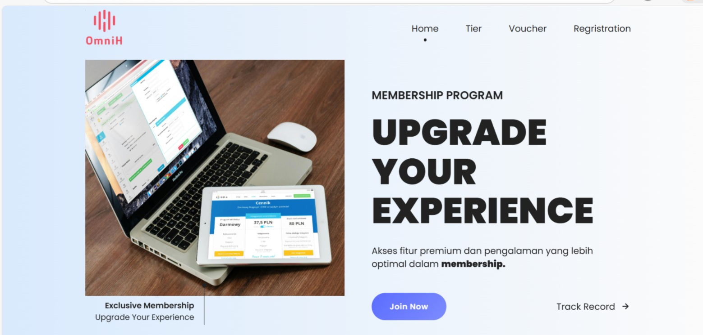
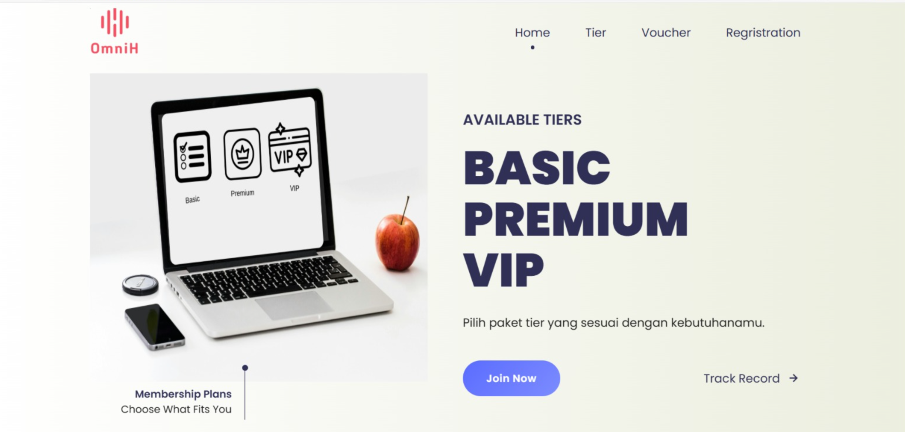
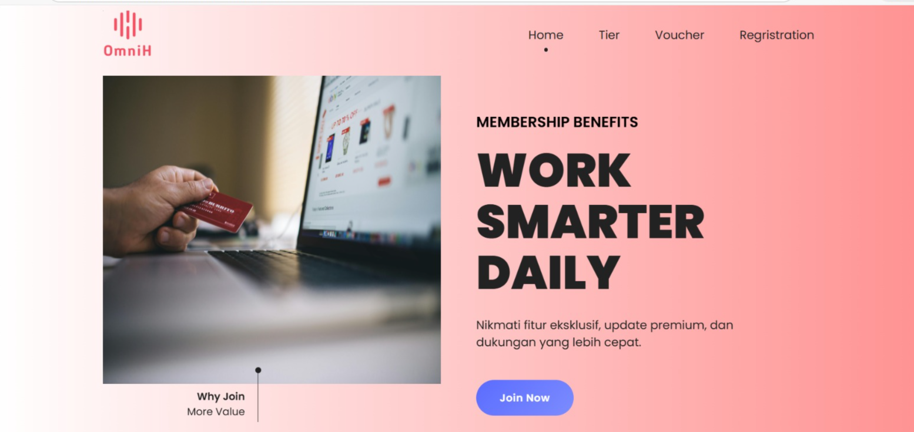
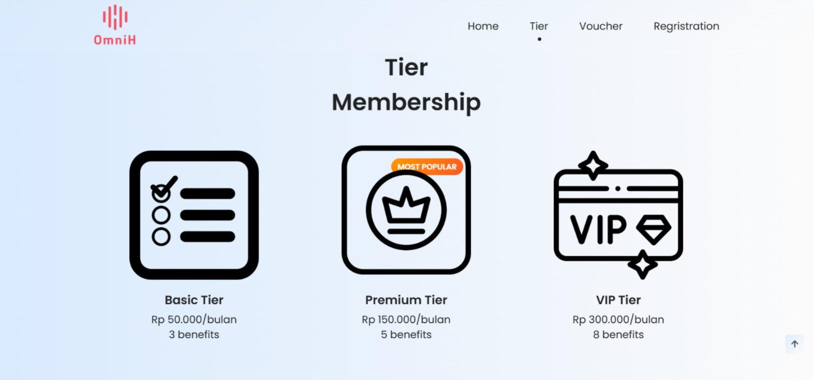
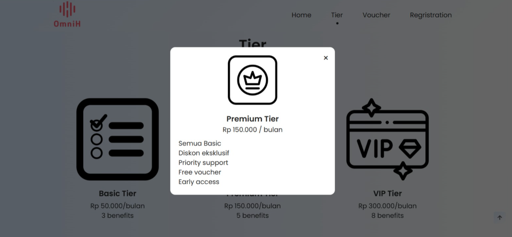
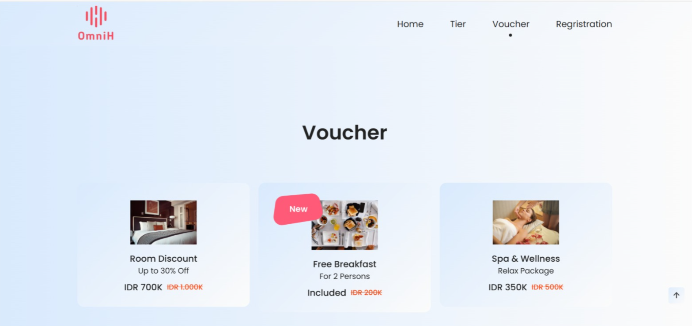
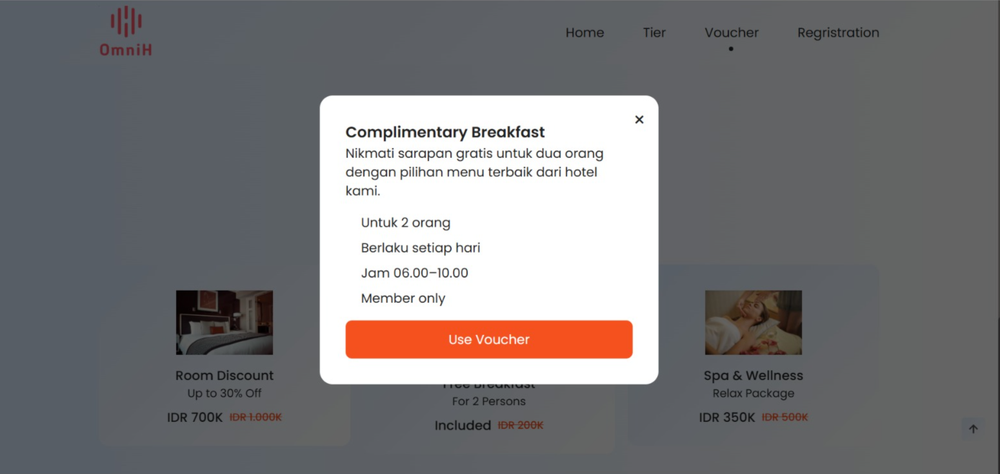
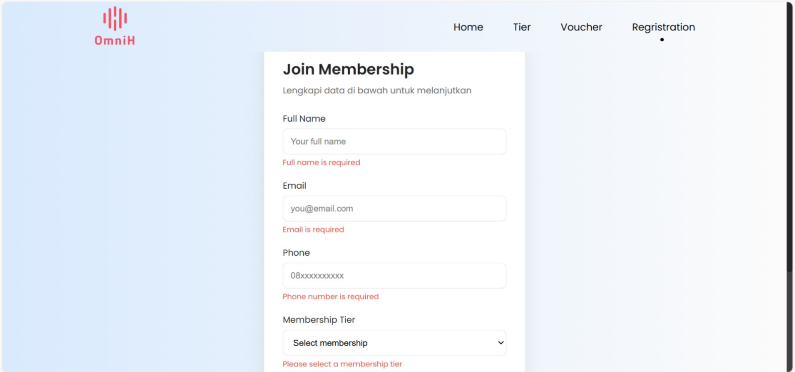

# Membership Landing Page

Website landing page membership dengan desain modern dan responsive.  
Project ini dibuat sebagai latihan frontend dan implementasi workflow Git profesional (branch per feature, commit terstruktur, dan deployment GitHub Pages).

---

## 🚀 Live Demo
👉 https://wayanryan.github.io/Project1/

---

## ✨ Features
- Homepage membership tiers (Basic, Premium, VIP)
- Responsive design (desktop & mobile)
- Interactive button & modal popup
- Clean UI with modern color palette

---

## 🛠️ Technologies Used
- HTML5
- CSS3 
- JavaScript
- Git & GitHub
- GitHub Pages

---

## 📸 Screenshots

### Homepage
ini adalah tampilan slider 1 di home page

ini adalah tampilan slider 2 di home page

ini adalah tampilan slider 3 di home page

### Membership Tiers Display
ini adalah tampilan tier yang ada 

ini adalah tampilan modal tier saat card tier di klik. 

### Voucher Section
ini adalah tampilan voucher yang ada 

ini adalah tampilan modal voucher saat card voucher di klik. 

### Form Registration
ini adalah tampilan form regristrasi yang ada 

---

